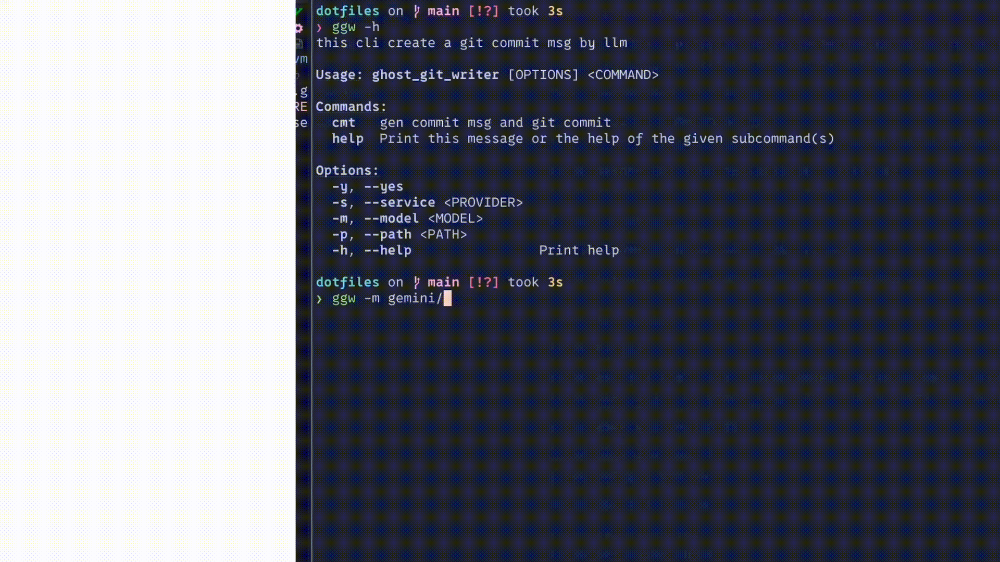

# ghost writer

**⚠️ beta.**

## Demo

ver.0.2.1



https://www.youtube.com/watch?v=6l42h0nn5Sk

## usage

```bash
# write a git commit msg for diff.
ggw -model gemini/gemini-2.0-flash cmt
# ask you that run git commit -m "msg"? by y / n

# auto commit without asking
ggw -model gemini/gemini-2.0-flash cmt -c
# or
ggw -y -model gemini/gemini-2.0-flash cmt
# ⚠️ `-y` flag is used to bypass additional confirmation prompts.)
```

### edit feat

```zsh
❯ ggw -m gemini/gemini-2.0-flash cmt
<<<commit mode>>>

read git diff...
creating commmit message...
created msg:fix: update version to 0.3.5 and dependencies
do you edit msg?(y/n)y
edit: feat: add edit feat when suggest llm's commnt

continue?(y/n)>y
```

## out exmaples

```
*  <6353330> 2025-07-16 [uliboooo]  (HEAD -> develop) fix: Remove duplicate println and fix typo in prompt
*  <a07f22f> 2025-07-16 [uliboooo]  feat: add auto commit option and yes option
*  <272de26> 2025-07-16 [uliboooo]  docs: Improve commit message generation prompt
```

## supported llm

[impl][test]

- [x] [ ] ollama
- [x] [ ] anthropic
- [x] [x] gemini
- [x] [ ] openai
- [x] [ ] deepseek

this program get **environment variables** for api_key.
env var name list

| Provider | API Key Env Variable |
| :---: | :---: |
| anthropic | `GGW_ANTHROPIC_API` |
| gemini | `GGW_GEMINI_API` |
| openai | `GGW_OPENAI_API` |
| deepseek | `GGW_DEEPSEEK_API` |

e.g. set `GGW_GEMINI_API=AAA444KEY` in .env or shell.

## default operation

## subcommand

| subcommand |      desc      |
| :--------: | :------------: |
|   `cmt`    | commit message |

## options

### global options

- `-y --yes`: don't confirm run commands
- ~~`-s --service [provider name]`: set provider~~
- ~~`-m --model [model name]`: set use model~~
- `-m --model [provider/model]`: you can set provider with model in -m option

### `cmt` options

- [ ] `-c --auto-commit"`: auto run git commit without confirm and `-y` option.

## features plan

- write a README
- Summarize about diff

