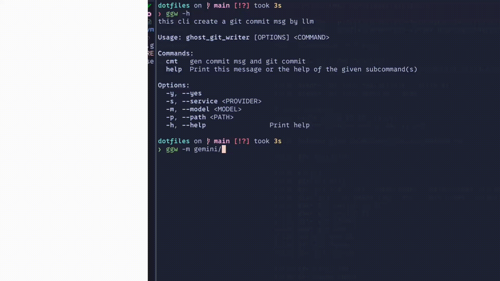

# ghost writer - `ggw`

[](https://www.rust-lang.org/)

**⚠️ beta ⚠️**

<!-- ## Demo

at ver.0.2.1



https://www.youtube.com/watch?v=6l42h0nn5Sk -->

## installing

```zsh
cargo install ghost_git_writer
```

## usage

```zsh
ggw [OPTIONS] <COMMAND>
```

- OPTIONS
  - `-y, --yes`: all yes without confirm
- COMMAND
  - `cmt`: generate a git commit message from git diff & run `git commit`
  - `rdm`: generate a README from forder and files by `-d <dir>` or `--source <file path list>`
  - `sum`: summazrize about changes from previous version code
  - `cst`: send custom message to llm service
- GLOBAL OPTIONS
  - `-m --model <MODEL>`: select model. split provider and llm model by '/'. e.g. `-m gemini/gemini-2.0-flash`
  - `-a --alias <ALIAS>`: select model from alias set in `~/.ggw.toml` or `~/.ggw/ggw.toml`. e.g. `-a gemini`
  - `-p --path <PATH>`: work path. use this to specify a directory other than current one.
  - `-o --one-line`: out only one line.
  - `-l --lang <LANG>`: specify language for llm output. e.g. `-l japanese`
  - `-e --extra <EXTRA>`: extra prompt. append `<EXTRA>` to end of default prompt.
  - `-c --auto-commit`: allow auto git commit

### Examples

```bash
# write a git commit msg from diff.
❯ ggw cmt -m gemini/gemini-2.0-flash
<<<commit mode>>>

read git diff...
creating commmit message...
created msg:docs: Update README with usage examples

do you edit msg?(y/n)n # if chose `y`, you can write a new commit yourself

continue?(y/n)>y

------------------------------------------------------

# you can use only this command if you set alias and default alias in ggw config.
ggw cmt
```

## result exmaples

```bash
*  <6353330> 2025-07-16 [uliboooo]  (HEAD -> develop) fix: Remove duplicate println and fix typo in prompt
*  <a07f22f> 2025-07-16 [uliboooo]  feat: add auto commit option and yes option
*  <272de26> 2025-07-16 [uliboooo]  docs: Improve commit message generation prompt
```

## supported llm

- [x] ollama
- [x] anthropic
- [x] gemini
- [x] openai
- [x] deepseek

this program get **environment variables** for api_key.
enviroment variable list

| Provider  | API Key Env Variable |
| :-------: | :------------------: |
| anthropic | `GGW_ANTHROPIC_API`  |
|  gemini   |   `GGW_GEMINI_API`   |
|  openai   |   `GGW_OPENAI_API`   |
| deepseek  |  `GGW_DEEPSEEK_API`  |

## Config format (v.0.9.0~)

```toml: ~/.ggw/.ggw.toml
[prompt.custom_prompt]
test = "this is test"

[llm]
default_alias = "ge"

[llm.model_alias.ge]
provider = "gemini"
model = "gemini-2.0-flash"

```

## old Config format (~v.0.8.1)

```json
{
  "prompt": {
    "custom_prompt": {
      "test": "this is test"
    }
  },
  "llm": {
    "default_alias": null,
    "model_alias": {
      "ge": {
        "provider": "gemini",
        "model": "gemini-2.0-flash",
        "temperature": null,
        "max_tokens": null
      }
    }
  }
}
```
